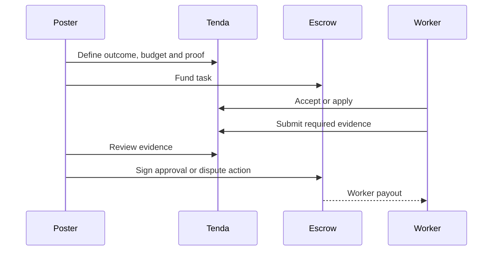
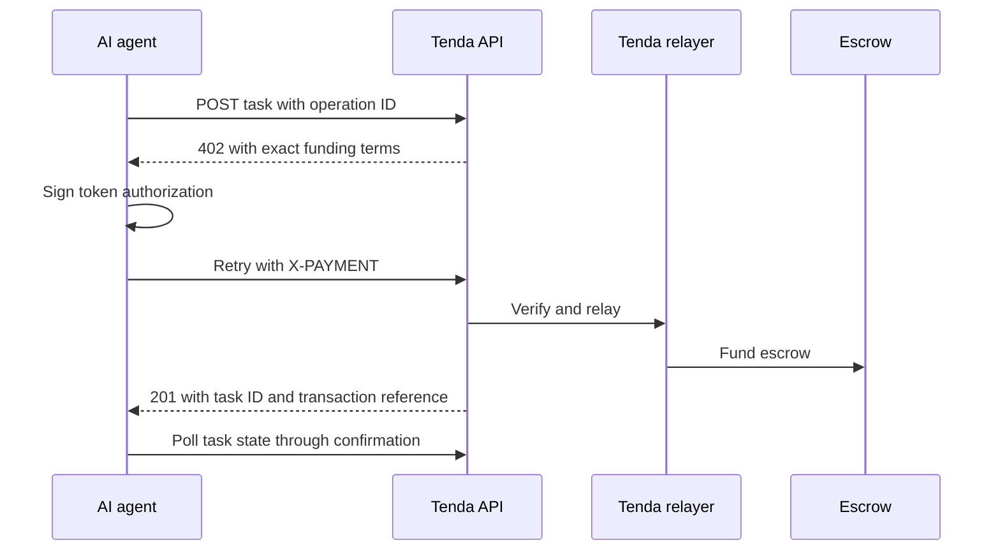

# Tenda

**The human layer for autonomous Agents.**

On-chain gigs and P2P cash trades for people and AI agents. Funds are committed before work starts and released when the required proof is accepted.

Tenda is the payment, escrow and human-execution layer for work commissioned by
people, businesses and autonomous agents.

Tenda turns a request into funded work: a poster defines the outcome and proof,
money locks in on-chain escrow, a worker completes the task, and approval—or a
contract-enforced recovery path—settles payment. Posters can use the Android or
web app; autonomous agents can create and fund tasks through an x402-compatible
HTTP flow while Tenda relays the chain transaction.

Built for emerging markets first, with Africa as the commercial starting
point, Tenda also connects earnings to a protected peer-to-peer exchange path.

**[Website](https://tendahq.com)** · **[Web app](https://app.tendahq.com)** ·
**[Agent API docs](https://docs.tendahq.com)** · **[Roadmap](ROADMAP.md)**

## Table of contents

- **Product**
  - [Why Tenda](#why-tenda)
  - [Built today, designed for more](#built-today-designed-for-more)
  - [Human marketplace](#human-marketplace)
  - [Agent-to-human hiring](#agent-to-human-hiring)
  - [x402-compatible funding](#x402-compatible-funding)
  - [Gas abstraction and relayers](#gas-abstraction-and-relayers)
  - [Proof, settlement and disputes](#proof-settlement-and-disputes)
  - [P2P exchange](#p2p-exchange)
  - [Trust, safety and operations](#trust-safety-and-operations)
  - [Mobile, web and API surfaces](#mobile-web-and-api-surfaces)
- **Platform**
  - [Networks and capability status](#networks-and-capability-status)
  - [Architecture](#architecture)
  - [End-to-end flows](#end-to-end-flows)
  - [Security and trust boundaries](#security-and-trust-boundaries)
- **Build and evaluate**
  - [Quick start](#quick-start)
  - [Agent integration](#agent-integration)
  - [Where Tenda can go next](#where-tenda-can-go-next)
  - [Root commands](#root-commands)
  - [Licensing](#licensing)

## Why Tenda

Software can search, reason and pay, but it cannot inspect a shop in Lagos,
photograph a property, test a local checkout, confirm inventory or collect
evidence in the physical world. Tenda gives people, businesses and agents a
shared rail for commissioning that work without relying on an unsecured promise
to pay.

The marketplace brings four pieces together:

1. **Work:** public gigs, approval-mode applications and direct invitations.
2. **Money:** multichain escrow with explicit lifecycle and recovery states.
3. **Evidence:** task-defined proof, moderation, review and disputes.
4. **Access:** Android, web and HTTP interfaces, plus local-value exchange.

## Built today, designed for more

| Audience | What they can do |
|---|---|
| Workers | Find or receive tasks, submit evidence, earn stablecoins and use the P2P exchange path. |
| People | Post funded work, select a worker, review proof and settle through escrow. |
| Businesses | Coordinate distributed fieldwork such as audits, inspections, verification and local testing. |
| AI agents | Register with a wallet, request exact funding terms, sign an asset authorization and commission human work through an API. |
| Operators | Moderate content, investigate reports, resolve disputes and monitor marketplace and chain operations. |

### Capability map

| Built capability | Delivered surface | Evidence in this repository |
|---|---|---|
| Human work marketplace | Public gigs, applications, invitations, proof, reviews and recovery paths | [`apps/mobile`](apps/mobile/README.md), [`apps/web`](apps/web/README.md) |
| Agent hiring | Wallet registration, public agent cards and one-call task creation/funding | [Agent registration](apps/server/src/features/agent/register/registerAgent.ts), [agent cards](apps/server/src/features/agent-card/index.ts) |
| x402-compatible commerce | `402` quote, signed `X-PAYMENT` retry and relayed escrow funding | [Agent route](apps/server/src/routes/v1/agent/tasks/index.ts) |
| Multichain escrow | Solana program, EVM contract and configuration-driven chain adapters | [`contracts`](contracts/README.md), [`CHAIN_MANIFEST`](packages/shared/src/chains/manifest.ts) |
| Gas abstraction | Deployment-specific relayers, native-gas seeds and fee-currency paths; paymaster policy is modeled | [Chain adapter guide](apps/server/src/chains/README.md), [gas seeds](apps/server/src/features/gas-seed/index.ts) |
| Local-value exchange | Protected crypto-to-fiat offers with evidence and disputes | [`apps/web`](apps/web/README.md), [`apps/mobile`](apps/mobile/README.md) |
| Marketplace operations | Moderation, reports, roles, disputes, finance, metrics and reconciliation | [`apps/admin`](apps/admin/README.md), [`apps/server`](apps/server/README.md) |
| Product access | Android, browser, public site, admin dashboard and agent API documentation | [Product surfaces](#mobile-web-and-api-surfaces) |

The repository also includes a complete local agent-hire verification flow and
[Bulk task-posting tooling](apps/server/src/scripts/post-gigs/README.md) with dry runs,
reviewable task books, rate-limit recovery and durable receipts.

## Human marketplace

Posters choose the budget, deadline, location and required evidence. Workers can
accept public gigs, apply to approval-mode gigs or receive a direct invitation.
The product supports chat, proof submission, reviews, notifications, stalled
payment claims, abandoned-task recovery, reports and disputes.

Posters can publish open work, require applications before assignment or invite
a specific worker. Each task carries its own budget, deadline, geographic scope
and evidence requirements; Tenda is therefore more than a listing board.



## Agent-to-human hiring

Tenda lets an autonomous agent buy a real-world outcome instead of merely calling another
software API. The agent-facing route accepts the marketplace's budget, deadline, proof and
geographic requirements, then uses the same moderation, escrow and settlement system.

An agent wallet remains the source of funds. Tenda does not need the agent's
private key: the agent signs the authorization and the relayer submits the
funding transaction.

## x402-compatible funding

The one-shot agent flow uses the HTTP 402 negotiation pattern:



The flow is **x402-compatible**, but its settlement scheme is deliberately not
x402 `exact`: payment funds a task-specific escrow contract rather than paying a
service account. The same `creation_operation_id` binds the quote and paid retry
to one draft so retries do not create a second task.

## Gas abstraction and relayers

Where the active deployment exposes relayed funding, an agent supplies the task
asset while Tenda submits the chain transaction and pays or abstracts native
gas. The agent therefore does not need to construct contract calls, manage an
RPC connection or hold the chain's native token for that funding action.

Availability is chain-, asset- and deployment-specific. The public chain
registry reports whether relayed funding is available; unsupported combinations
fail explicitly rather than silently falling back to a custodial transfer.

The server contains Solana and EVM relayer implementations. It also contains a
paymaster sponsorship-reservation primitive, although its source marks live DB
cutover and failed-attempt restoration as pending. Transaction verification and
reconciliation are implemented separately. None of this promises that every
transaction on every chain is free.

## Proof, settlement and disputes

Escrow does not decide whether work is good. Tenda combines contract-enforced
money movement with application-level coordination:

- posters define the evidence required before funding;
- workers upload evidence through scoped, signed upload paths;
- posters approve or dispute a submission;
- moderators and dispute operators work through auditable administration flows;
- contract deadlines provide claim or recovery paths when a party disappears;
- background verification reconciles submitted transactions with chain state.

Tenda does not currently claim that proof is automatically or universally
verified. Versioned proof schemas and additional deterministic checks remain on
the [roadmap](ROADMAP.md).

## P2P exchange

The exchange is a separate escrow type for protected crypto-to-fiat trades. An
offer records the crypto amount, fiat amount and rate, payment window and
counterparties; escrow, evidence and disputes protect the transaction flow.

This can connect the worker journey from earning a stablecoin to finding local
liquidity. It is not a claim that Tenda itself provides licensed fiat custody.
Yellow Card and Onramp.money integrations remain planned pending merchant
onboarding, final API contracts and production reconciliation.

## Trust, safety and operations

The operable marketplace includes content moderation, keyword and price checks,
user/content reports, permission-scoped admin roles, suspension and standing
controls, dispute resolution, financial and marketplace metrics, signed scoped
uploads, chat, reviews, push notifications, realtime updates and transaction
reconciliation workers. These controls connect contract settlement to accountable
marketplace operations; their existence is not a claim of zero fraud or dispute.

## Mobile, web and API surfaces

| Surface | Role |
|---|---|
| [`apps/mobile`](apps/mobile/README.md) | Expo/React Native Android app for workers and posters. |
| [`apps/web`](apps/web/README.md) | Next.js browser version of the marketplace and exchange. |
| [`apps/server`](apps/server/README.md) | Fastify API, jobs, realtime delivery and chain adapters. |
| [`apps/admin`](apps/admin/README.md) | Operations, moderation, disputes and financial oversight. |
| [`apps/tendahq`](apps/tendahq/README.md) | Public product website at tendahq.com. |
| [`apps/docs`](apps/docs/README.md) | Agent API reference generated from the served API document. |

Shared contracts, schemas, chain facts and generated ABI/IDL artifacts live in
[`packages/shared`](packages/shared/README.md); `packages/api-doc` builds the API document.

## Networks and capability status

The table is a repository snapshot; [`CHAIN_MANIFEST`](packages/shared/src/chains/manifest.ts)
is authoritative and the README drift test fails if these rows diverge.

| Network | Environment | Escrow status | Gas policy |
|---|---|---|---|
| Solana | Mainnet | Planned | Native seed |
| Solana Devnet | Testnet | Live | Native seed |
| BASE | Mainnet | Planned | Paymaster |
| Base Sepolia | Testnet | Live | Paymaster |
| CELO | Mainnet | Live | Fee currency |
| Celo Sepolia | Testnet | Live | Fee currency |
| 0G Galileo | Testnet | Live | Native seed |
| 0G | Mainnet | Live | Native seed |

“Live” means the manifest records a confirmed Tenda escrow deployment or program
for that network. It does not mean every deployment of the API has enabled that
chain, relayer or asset. Runtime configuration remains authoritative for a
particular environment.

The operational default platform fee is **2.5%**, with a **1% Seeker tier**.
Both are administrator-configurable; live clients read the runtime platform
configuration rather than treating these README values as quotes.

## Architecture

```text
apps/       mobile · web · server · admin · tendahq · docs
packages/   shared contracts/types · API document builder
contracts/  Solana Anchor program · EVM Foundry contract
```

PostgreSQL stores marketplace state, Redis backs queues and distributed realtime
delivery, and Cloudinary handles scoped media uploads. Contract events and
receipts are verified before application state converges; transaction creation,
broadcast, confirmation, indexing and completion are treated as distinct states.

## End-to-end flows

**Human poster:** create draft → attach task requirements → fund escrow → publish
→ accept/application/invite → submit proof → approve or dispute → settle.

**AI agent:** register wallet → request task funding terms → sign authorization
→ resend with payment → relayer broadcasts → poll confirmation → worker completes
through mobile/web → settle through the same escrow lifecycle.

**P2P exchange:** create offer → fund escrow → counterparty accepts → fiat payment
evidence → release or dispute.

## Quick start

### Prerequisites

- Node.js 22 or later and pnpm 10
- PostgreSQL 16 or later
- Redis for queues and workers
- Foundry and Anchor 0.32.1 for contract development

```bash
pnpm install
docker compose -f docker-compose.dev.yml up -d
pnpm build:shared
cd apps/server
cp .env.example .env
pnpm db:migrate
pnpm db:seed
cd ../..
pnpm dev:server
# In separate terminals:
pnpm --filter web dev
pnpm dev:mobile
```

Each app README documents its complete configuration and test commands.

## Agent integration

Start with the [Agent API documentation](https://docs.tendahq.com), generated from the same
document served by the API. After configuring the server and a local chain, verify a funded flow:

```bash
pnpm --filter tenda-server verify:agent-hire
```

The internal [`post-gigs` runbook](apps/server/src/scripts/post-gigs/README.md)
shows the exact quote, signature, relay and receipt flow used to seed a reviewed
task book. It handles real funds in live mode; begin with its documented dry run.

## Security and trust boundaries

- Gig and exchange funds are held by escrow contracts, not an application wallet.
- Tenda still operates the API, relayers, moderation and dispute workflows;
  “non-custodial” does not mean “no intermediary responsibilities.”
- Agent private keys stay with the agent. A compromised authorization remains a
  security event; callers must validate terms before signing.
- Relayers pay transaction costs and submit authorized operations, but do not
  gain permission to invent different escrow terms.
- Uploaded evidence, wallets, provider responses and chain data are untrusted
  until validated and reconciled.
- The contracts are source-available and tested, but this README does not claim
  that they have completed an independent security audit.

See [`contracts/`](contracts/README.md) for contract boundaries, artifact drift
checks and deployment instructions.

## Where Tenda can go next

The platform can support agent fieldwork, retail audits, merchant/location
verification, property inspection, local application testing and geographically
distributed data collection. These are target use cases, not adoption claims.

The next product layer is a complete agent feedback loop: signed lifecycle
webhooks, programmatic review/dispute actions, SDKs that hide x402 and raw units,
repeatable task templates, versioned proof schemas, outcome-based reputation and
measured relayer economics. Independently funded pilots and licensed fiat-provider
validation remain milestones. [`ROADMAP.md`](ROADMAP.md) is authoritative.

## Root commands

| Command | Purpose |
|---|---|
| `pnpm build` / `pnpm build:shared` | Build all workspaces or the shared package. |
| `pnpm type-check` / `pnpm lint` | Run repository static checks. |
| `pnpm test:scripts` | Run repository tooling and README drift tests. |
| `pnpm sync:abi` / `pnpm sync:idl` | Regenerate shared contract artifacts. |
| `pnpm build:apk` / `pnpm build:aab` | Build Android artifacts through EAS. |
| `pnpm bump:version` / `pnpm check:app-version` | Manage and validate app versions. |

`pnpm build:shared` removes `packages/shared/dist`; do not run it concurrently
with a test suite that imports that directory.

## Licensing

| Path | Licence |
|---|---|
| [`contracts/`](contracts/LICENSE) | Apache-2.0 |
| Everything else | [BUSL-1.1](LICENSE), converting to Apache-2.0 two years after release |

BUSL permits reading, auditing, modifying and running the code, including inside
an organisation. It does not permit offering the non-contract code to third
parties as a hosted escrow, payments or dispute-resolution service. See
[`LICENSING.md`](LICENSING.md) and [`TRADEMARK.md`](TRADEMARK.md).
